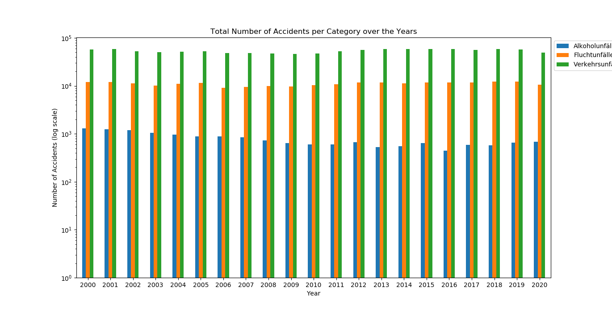
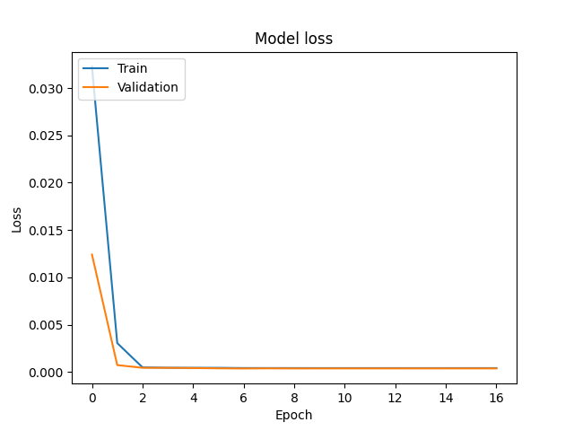
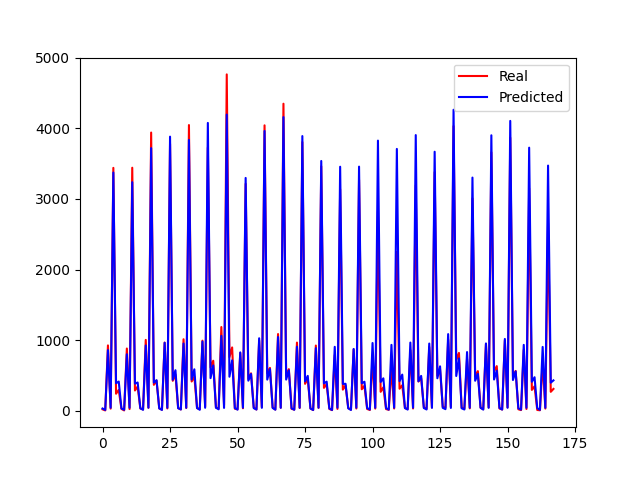

# traffic-accidents-analysis


This project involves Time Series Forecasting using [Monatszahlen Verkehrsunfälle](https://www.opengov-muenchen.de/dataset/monatszahlen-verkehrsunfaelle/resource/40094bd6-f82d-4979-949b-26c8dc00b9a7) dataset.

The project has been deployed on _Heroku_ at <ins>[traffic-predictor.herokuapp.com](https://traffic-predictor.herokuapp.com/)</ins>. The application end point accepts a **POST** request with a **JSON** body of the format: 
```json
{
    "Category": "Verkehrsunfälle", 
    "Accident_type": "mit Personenschäden", 
    "Prev_Year_Value":373
}
```
The model returns a forecast value in the following format:
```json
{
    "prediction":value
}
```
## Data Visualization
Following figure plots total number of accidents of different categories over the years: 
<p align="center">
  
</p>

## Getting Started
- Install required packages
```sh
   pip install -r requirements.txt
```
-  Data preprocessing (to generate data transforms) 
```sh
   python preprocess_data.py
```
- Network training from scratch
```sh
   python train.py -lr [learning_rate] -e [epochs] -b [batch_size] -d [output_dir]
```
- Prediction on custom CSV file
```sh
   python predict.py -i [input_file_path] -o [output_file] -w [weights_path]
```

## Network Architecture
```
Model: "Deep_Regression_Model"
_________________________________________________________________
Layer (type)                 Output Shape              Param #   
=================================================================
input (InputLayer)           [(None, 7)]               0         
_________________________________________________________________
fc0 (Dense)                  (None, 8)                 64        
_________________________________________________________________
fc1 (Dense)                  (None, 4)                 36        
_________________________________________________________________
output (Dense)               (None, 1)                 5         
=================================================================
Total params: 105
Trainable params: 105
Non-trainable params: 0
_________________________________________________________________
```
## Training Loss Plot
<p align="center">
  
</p>

## Model Evaluation
The following compares actual and predicted values on test set. 

<p align="center">
  
</p>

## Results
<table>
    <tr>
        <th></th>
        <th>Loss</th>
        <th>MAE</th>
    </tr>
    <tr>
        <th>Train Set</th>
        <td>4.2455e-04</td>
        <td>0.0156</td>
    </tr>
    <tr>
        <th>Validation Set</th>
        <td>3.8778e-04</td>
        <td>0.0158</td>
    </tr>
    <tr>
        <th>Test Set</th>
        <td>0.00086</td>
        <td>0.01867</td>
    </tr>
</table>

